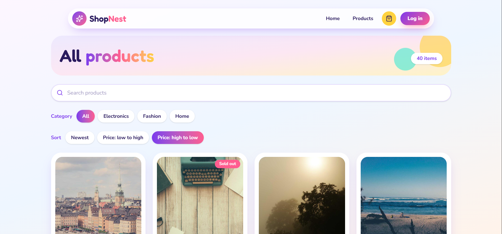
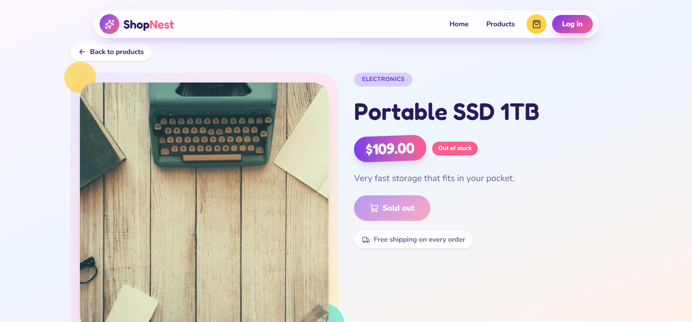
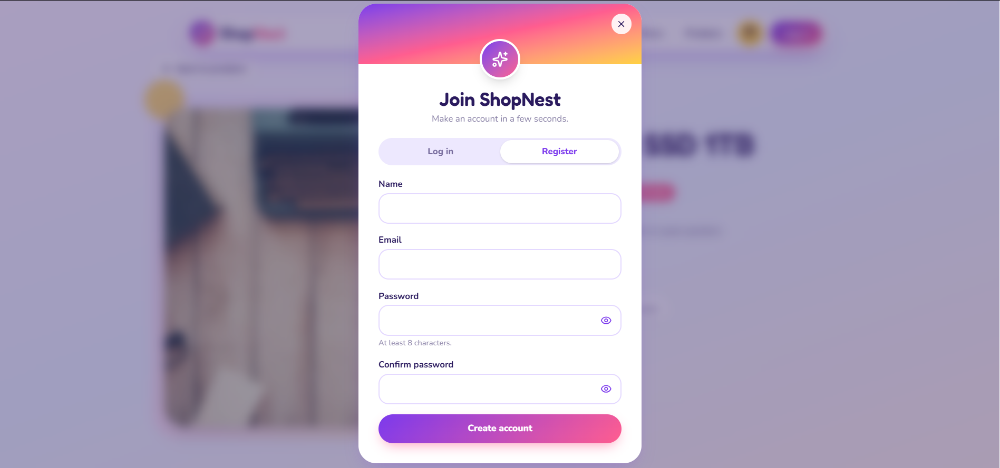
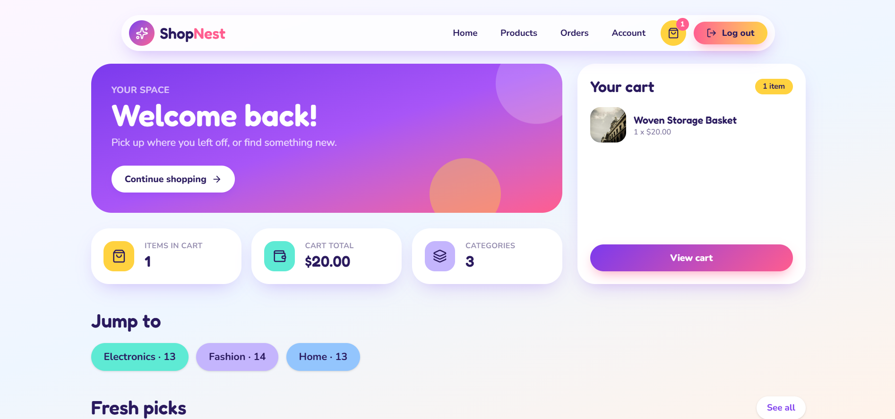
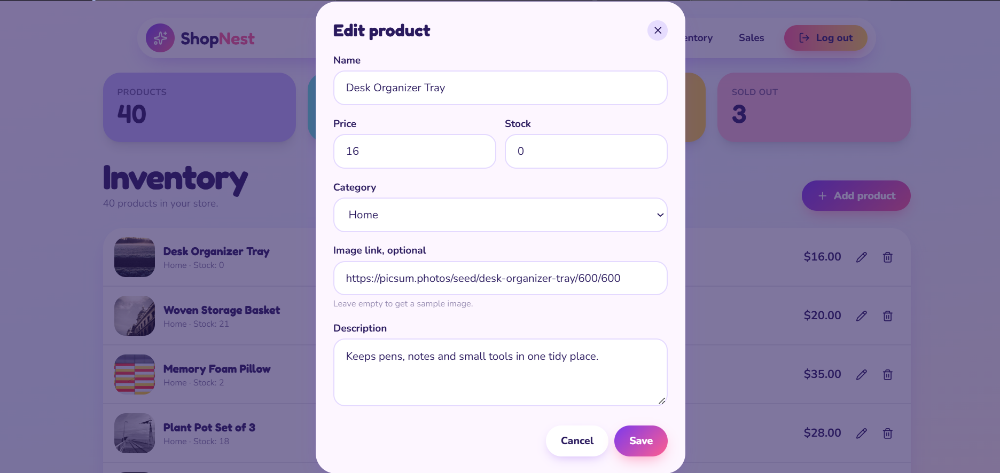
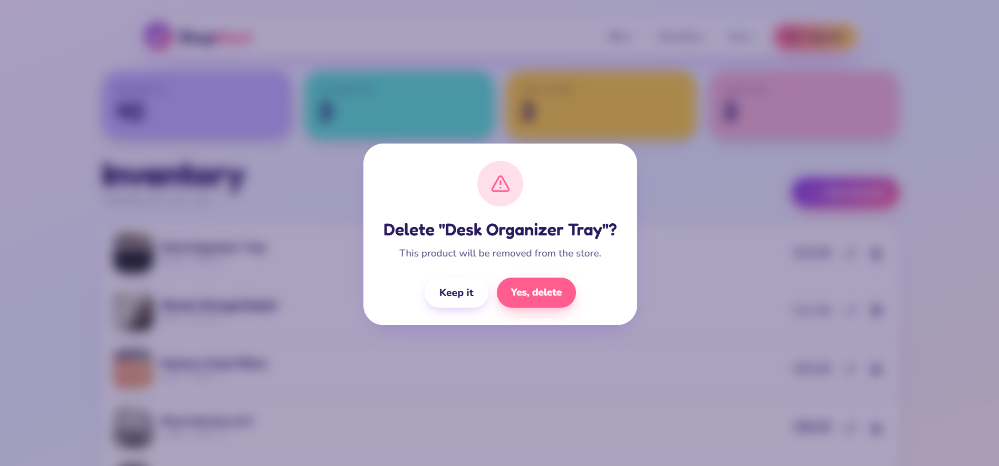

<div align="center">

# 🛍 ShopNest

**A colorful, playful online store with checkout, orders and an admin panel.**


[Live Demo](https://ecommerce-store-black-tau.vercel.app/)

</div>

## 📑 Table of Contents

- [About](#-about)
- [Features](#-features)
- [Screenshots](#-screenshots)
- [Getting Started](#-getting-started)
- [Demo Accounts](#-demo-accounts)
- [Author](#-author)

## 📖 About

ShopNest is a full e-commerce site. Customers can browse products, fill a cart, check out and track orders. One admin manages every order. It was built as Task 4 of the Auspify internship.

## 🚀 Features

| For | Feature |
|---|---|
| Customers | Browse 30 products and add to cart |
| Customers | Checkout and order history |
| Customers | Account page |
| Customers | Login and register in a popup |
| Admin | Dashboard with order management |
| Everyone | Responsive playful design with gradients |

New sign-ups are always customers. There is only one admin account.

## Screenshots

### Landing Page

#### Landing Page


#### Landing Page - Section 2


#### Landing Page - Section 3


### Product Browsing

#### Browse Products


#### Products Pagination


#### Product Details



### Authentication

#### Register / Login



### Checkout

#### Checkout Page


#### Delivery Details


### User Dashboard

#### User Dashboard


#### User Dashboard - Alternative View


#### User Orders


### Admin Dashboard

#### Admin Dashboard


#### Manage Orders


#### Confirm Order


#### Update Product


#### Remove Product



### UI & Loading

#### Loading Animation


## Responsive Design

The application is fully responsive and optimized for desktop and mobile devices.

### Mobile Landing Page


### Mobile Product Browsing


### Mobile Product Details


### Mobile Checkout


## ⚙️ Getting Started

```bash
git clone https://github.com/Hashim017/<repo-name>.git
cd <repo-name>
npm install
```

Create a file named `.env` in the project root:

```
DATABASE_URL="your-postgres-connection-string"
```

Set up the database, add the sample products and start the app:

```bash
npx prisma migrate dev
npx prisma db seed
npm run dev
```

## 🔑 Demo Accounts

| Role | Email | Password |
|---|---|---|
| Admin | `admin@example.com` | `admin12345` |
| Customer | `demo@example.com` | `password123` |

## 👤 Author

**Muhammad Hashim** - [GitHub](https://github.com/Hashim017)